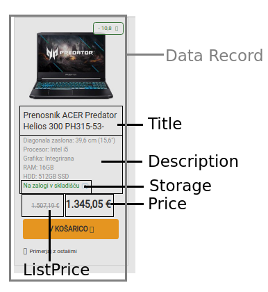

# WIER 2021: Programming assignment 2, Report
Klemen Stanič, 63150267 \
Luka Kavčič, 63150139


## 1. Introduction
The goal of this assignment was to implement an automatic data extraction from given HTML pages using three different approaches.
The first and second types of extraction are based on static rules, that are specific to a certain page we want to extract our data from. The third approach is automatic, meaning that we try to automaticaly determine the most relevant data on the page.


## 2. Implementation
### I. Two additional web pages
Part of our assignment was to select two similar web pages from a single website. We decided on *altsore.si* website as our selected source. We then used these two additional pages alongside the provided pages for testing three different approaches of data extraction.
A data record and the data items within are presented in following image. 



### II. Regular expressions implementation
Regular expression we used are presented below. Data records on websites *overstock.com* and *altstore.si* were extracted using only one regular expression (All data records). Each data item was separatly extracted from the gathered data record.
```
RTV:
 Author: re.search('<div class="author-name">(?P<Author>.*?)</div>', html)
 PublishedTime: re.search('<div class="publish-meta">(?P<PublishedTime>(.|\s)*?)<br>', html)
 Title: re.search("<h1>(?P<Title>.*?)</h1>", html)
 SubTitle: re.search('<div class="subtitle">(?P<SubTitle>(.|\s)*?)</div>', html)
 Lead: re.search('<p class="lead">(?P<Lead>(.|\s)*?)</p>', html)
 Content: re.search('<article class="article">(?P<Content>(.|\s)*?)</article>', html)

Overstock:
 All data records: re.findall('<td valign="top">..<a.*?</tbody></table></td>', html, flags=re.S)
 Within a single data record:
  Title: re.search('<a href=".*?<b>(?P<Title>.*?)</b>', el)
  ListPrice: re.search('<b>List Price:</b>.*<s>(?P<ListPrice>.*?)</s>', el)
  Price: re.search('<b>Price:</b>.*?<b>(?P<Price>.*?)</b>', el)
  Saving: re.search('<b>You Save:</b>.*?littleorange">(?P<Saving>.*) \(', el)
  SavingPercent: re.search('<b>You Save:</b>.*?littleorange">.*?\\((?P<SavingPercent>.*)\)', el)
  Content: re.search('<td valign="top"><span class="normal">(?P<Content>.*?)<br>', el, flags=re.S)

Altstore:
 All data records: re.findall('<div class="card .*?</div>.</div>', html, flags=re.S)
 Within a single data record:
  Title: re.search('<h4 class="fixed-lines-2"><a href.*?">(?P<Title>.*?)</a></h4>', el)
  Price: re.search('<span class="old-price">(?P<Price>.*?)</span>', el)
  ListPrice: re.search('<span class="new-price">(?P<ListPrice>.*?)</span>', el)
  Description: re.search('<small class="options_list">(?P<Description>.*?)</small>', el)
  Storage: re.search('<div class="stock-info.*?<span>.(?P<Storage>.*?)<a href', el, flags=re.S)
```

### III. XPath implementation:
We used a similar logic here, where we extracted each data record using one xpath expression and then one for each data item.
```
RTV:
 Author: tree.xpath('.//div[@class="author-name"]')[0].text
 PublishedTime: tree.xpath('.//div[@class="publish-meta"]')[0].text.split('<br>')[0].strip()
 Title: tree.xpath('.//h1')[0].text
 SubTitle: tree.xpath('.//div[@class="subtitle"]')[0].text
 Lead: tree.xpath('.//p[@class="lead"]')[0].text
 Content: tree.xpath('.//article[@class="article"]')[0]

Overstock:
 All data records: tree.xpath('/html/body/table[2]/tbody/tr[1]/td[5]/table/tbody/tr[2]/td/table/tbody/tr/td/table/tbody/tr/td')
 Within a single data record:
  Title: item.xpath('.//a/b')[0].text
  Price: item.xpath('.//tr/td/s')[0].text
  ListPrice: item.xpath('.//tr/td/span/b')[0].text
  Saving: item.xpath('.//tr/td/span[@class="littleorange"]')[0].text.split(' ')[0]
  SavingPercent: item.xpath('.//tr/td/span[@class="littleorange"]')[0].text.split(' ')[1].replace('(', '').replace(')', '')
  Content: item.xpath('.//table/tbody/tr/td/span')[2].text

Altstore:
 All data records: tree.xpath('.//div[@class="card "]'):
 Within a single data record:
  Title: item.xpath('.//h4[@class="fixed-lines-2"]/a')[0].text
  Price: item.xpath('.//span[@class="old-price"]')[0].text
  ListPrice: item.xpath('.//span[@class="new-price"]')[0].text
  Description: item.xpath('.//small[@class="options_list"]')
  Storage: item.xpath('.//div[2]/span')[0].text.strip()
```

### IV. RoadRunner implementation:
For the third approach, we implemented the RoadRunner algorithm for automatic data extraction. We used the paper[1] as our guide. The whole process is split into two stages. First, we preprocess the HTML data of both the sample and wrapper pages. In this step we remove unnecessary HTML DOM elements (including *script*, *input*, *button*, *select*, *style*, *iframe*, *form*, *figure*, *svg* and *br*), that don't contribute to the essence of the information on the given page. The whole HTML is then transformed into XHTML, stripped of all tabs and new line characters and finally passed to the RoadRunner algorithm. The pseudocode of our RoadRunner algorithm is presented below.

```
def square_match():
  match square tags in reverse order with tags above the given square.
  if not match —> not square
  if all tags match —> square

def find_square():
  terminal_tag = tag before mismatch
  while not at the end of wrapper:
    search for terminal_tag
    if found —> square = square_match()
    if not square —> continue search

  if square not found —> repeat the process on sample

  if square not found on wrapper and sample —> not an iterator

  search for all occurences of square on the wrapper
  replace all occurences with one square marked as iterator
  continue main() function from tags below iterator


def find_iterator():
  check if tags before mismatch match:
  if not match —> it's not an iterator
  else —> find_square()

def find_optional():
  find the optional element by cross searching the mismatching tags on the wrapper and the sample
  if matching_element found on wrapper —> change all wrapper elements from mismatch to matching_element to optionals 
  else —> add optional elements to wrapper

def main():
  loop until we reach the end of wrapper or sample:
    check for tag mismatch on current wrapper and sample elements
    if not mismatch —> continue

    check for string mismatch
    if mismatch —> change wrapper element to '#TEXT' and continue

    result = find_iterator()
    if not result:
      find_optional()
```

#### V. UFRE Notation
We use Union-Free Reqular Expression notation in order to represent string mismatches, optionals and iterators in our RoadRunner wrapper output. Therefore, optionals are represented as (\<OPTIONAL\>)?, iterators as (\<ITERATOR\>)+ and string mismatches as \#TEXT.


## 3. Results
The regular expressions and XPath approaches give expected results.

Our implementation of RoadRunner gives correct results on the test samples, presented in the paper. The algorithm performs rather well on the *altstore.si* webpages. However, the output wrapper is wrong on the *overstock.com* and *rtvslo.si* pages. This is due to the fact,that our algorithm is not implemented recursively, and therefore can't properly match squares in the find_iterator sections.


## 4. Conclusions
RoadRunner algorithm implemenation proved to be the most difficult part of this assignment. We tried a few different approaches. Firstly, we tried to solve the problem using trees, which proved not to be the best choice. Then, we tried to follow the simplified version of the algorithm, presented in the paper. We tried expanding our algorithm with recursion, which proved to be too difficult.

We also tried to include tag attributes (e.g. *class*) during the process of tag comparison, which turned out to give no significant improvements.

 We present the output wrappers of the sample pages in the next chapter. We decided not to include the outputs, ran on other websites in this report, since they are too long. The outputs of web pages can be found in `input-extraction/<webpage>/wrapper.html` files.

## 5. Wrapper outputs:
Wrapper page:
```
<html>
<body>
	Books of:
	<b>
		John Smith
	</b>
	<ul>
		<li>
			<I>
				Title:
			</I>
			Web mining
		</li>
		<li>
			<I>
				Title:
			</I>
			Comp. Sys.
		</li>
	</ul>
</body>
</html>
```

Sample page:
```
<html>
<body>
	Books of:
	<b>
		Paul Jones
	</b>
	
	<ul>
		<li>
			<I>
				Title:
			</I>
			Web mining
		</li>
		<li>
			<I>
				Title:
			</I>
			Comp. Sys.
		</li>
		<li>
			<I>
				Title:
			</I>
			Javascript
		</li>
	</ul>
</body>
</html>
``` 

Output:
```
<html>
<body>
Books of:
<b>
#TEXT
</b>
()?
(</img>)?
<ul>
(<li> <i> Title: </i> #TEXT </li>)+
</ul>
</body>
</html>
```

## 6. Literature
[1] Crescenzi, Valter, Giansalvatore Mecca, and Paolo Merialdo. "Roadrunner: Towards automatic data extraction from large web sites." VLDB. Vol. 1. 2001.